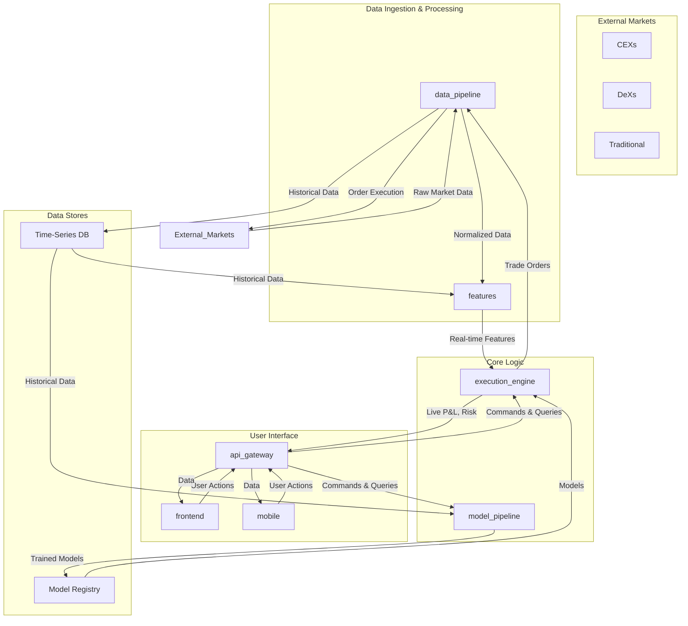

# Architecture

This document contains the architecture diagrams for the AI Trading & Arbitrage Platform.

## High-Level Architecture

```mermaid
graph TD
    subgraph "External Markets"
        direction LR
        CEX[CEXs]
        DeX[DeXs]
        Trad[Traditional]
    end

    subgraph "Data Ingestion & Processing"
        direction TB
        Data[data_pipeline]
        Features[features]
    end

    subgraph "Core Logic"
        direction TB
        Model[model_pipeline]
        Execution[execution_engine]
    end

    subgraph "User Interface"
        direction RL
        API[api_gateway]
        Web[frontend]
        Mobile[mobile]
    end

    subgraph "Data Stores"
        direction TB
        TSDB[Time-Series DB]
        ModelRegistry[Model Registry]
    end

    %% Connections
    External_Markets -- "Raw Market Data" --> Data
    Data -- "Normalized Data" --> Features
    Features -- "Real-time Features" --> Execution
    Data -- "Historical Data" --> TSDB
    TSDB -- "Historical Data" --> Features
    TSDB -- "Historical Data" --> Model

    Model -- "Trained Models" --> ModelRegistry
    ModelRegistry -- "Models" --> Execution

    Execution -- "Trade Orders" --> Data
    Data -- "Order Execution" --> External_Markets

    Web -- "User Actions" --> API
    Mobile -- "User Actions" --> API
    API -- "Commands & Queries" --> Execution
    API -- "Commands & Queries" --> Model

    Execution -- "Live P&L, Risk" --> API
    API -- "Data" --> Web
    API -- "Data" --> Mobile
```
